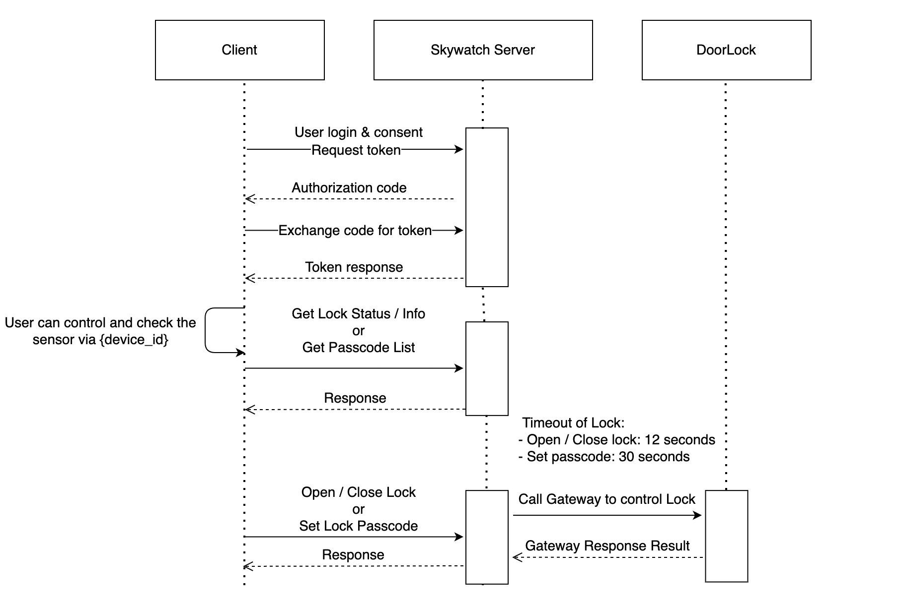

# skywatch-php-sdk

PHP library for skywatch platform.

**Reminder: Only support Doorlock sensor for now!**

# Demo

- Install http server such as Apache or Nginx
- Make sure 'http://localhost:port/index.php' and 'http://localhost:port/api.php' are available.
- Open the demo page: http://localhost:port/index.php
- Click `Link to Skywatch` and login with Skywatch's account

# Usage

- Set `redirect_url` in xxxxx.php
- Set `APP_ID` in xxxxx.php
- Set `APP_SECRET` in xxxxx.php

# API Documents

[Doorlock API](https://hackmd.io/@skywatch/SyqnMUWRw)

[Doorlock API Error Response](https://gist.github.com/alon21034/555203ac0fbcf748dde5fcc8a5122f22#file-error_response-md)

[Camera API](https://hackmd.io/@skywatch/HJr4Y8dhd)



### initialize

#### Step 1. Get `auth_code` from Authorization URL:

Open this URL below in the web browser.

```
service.skywatch24.com/oauth2?app_id='app_ip'&redirect_uri='redirect_uri'
```

When user grants authorization, the website will redirect to the `redirect_url` and contain `auth_code` in the url.

| Parameter      | Type     | Required | Description                                                         |
| -------------- | -------- | -------- | ------------------------------------------------------------------- |
| `app_id`       | `string` | YES      | The `app_id` is a public identifier for your skywatch applications. |
| `redirect_url` | `string` | YES      | The URL that you want to receive the authorization code.            |

#### Step 2. Initialize with $auth_code

```php
use Skywatch\SkywatchResource;
$skywatch = new SkywatchResource();
$access_token = $skywatch->getAccessToken($auth_code);
$skywatch->init($access_token);
```

### User Info

```php
$skywatch->getUserInfo();
```

### Device List

```php
$skywatch->getDeviceList();
```

#### Example Output:

```json
[
  {
    "id": "1",
    "model_id": "74",
    "parent": "1",
    "online": "1",
    "name": "Gateway 2",
    "active": "1",
    "type": "own",
    "share_permission": "111",
    "device_type": "gateway",
    "ibit": "0",
    "mobile_view_available": "0",
    "sphere_available": "0",
    "model": "74",
    "armactive": "1",
    "audio_id": "0",
    "owner_name": ""
  },
  {
    "id": "3",
    "model_id": "63",
    "parent": "1",
    "online": "1",
    "name": "Door Lock",
    "active": "1",
    "type": "own",
    "share_permission": "111",
    "device_type": "sensor",
    "ibit": "0",
    "mobile_view_available": "1",
    "sphere_available": "0",
    "params": {
      "background_color": {
        "r": "0",
        "g": "165",
        "b": "230",
        "a": "100",
        "type": "color",
        "raw": ""
      },
      "image": {
        "value": "/api/v2/models/doorlock/image?status=online&value=__U__",
        "type": "image",
        "raw": "__U__"
      },
      "name": {
        "value": "Door Lock",
        "type": "text",
        "raw": "Door Lock"
      },
      "value_control": {
        "value": "--",
        "type": "text",
        "title": "",
        "raw": ""
      },
      "user_code": {
        "value": "api/v2/devices/3/doorcodeview",
        "type": "ext_page",
        "text": "管理通行密碼"
      },
      "switch_control": {
        "value": "__U__",
        "type": "switch",
        "raw": ""
      },
      "detail_control": {
        "value": "",
        "type": "list",
        "color": "blue",
        "trigger_based": "1"
      }
    },
    "modes_available": [
      {
        "key": "daily",
        "title": "日"
      },
      {
        "key": "weekly",
        "title": "週"
      },
      {
        "key": "monthly",
        "title": "月"
      }
    ],
    "model": "doorlock",
    "armactive": "1",
    "audio_id": "0",
    "owner_name": ""
  }
]
```

| Parameter  | Description                                                                                    |
| ---------- | ---------------------------------------------------------------------------------------------- |
| `id`       | Device Id                                                                                      |
| `name`     | Device name                                                                                    |
| `online`   | Online: 1, Offline: 0                                                                          |
| `model_id` | Gateway 2: 74, Gateway 2.5: 91, DoorLock: 63, PowerLock(斷電解鎖): 83, PowerLock(上電解鎖): 84 |

### Set Device Name

```php
$skywatch->updateDeviceName($device_id, $name)
```

| Property    | Type     | Required | Description |
| ----------- | -------- | -------- | ----------- |
| `device_id` | `string` | YES      | Sensor id   |
| `name`      | `string` | YES      | Sensor name |

### Lock Info

```php
$skywatch->getStatus($doorlock_id);
```

| Property      | Type     | Required | Description |
| ------------- | -------- | -------- | ----------- |
| `doorlock_id` | `string` | YES      | Sensor id   |

#### Example Output:

```json
{
  "cameraStatusCode": "online",
  "firmwareUpgradeAvailable": "false",
  "rebootAvailable": "true",
  "wrong_password": "0",
  "cameraAlert": "false",
  "cameraServiceImage": "",
  "has_er": "0",
  "has_cr": "0",
  "has_cr_pro": "0",
  "recover_from_sd": "0",
  "params": {
    "background_color": {
      "r": "0",
      "g": "165",
      "b": "230",
      "a": "100",
      "type": "color",
      "raw": ""
    },
    "image": {
      "value": "/api/v2/models/doorlock/image?status=online&value=0",
      "type": "image",
      "raw": "0"
    },
    "name": {
      "value": "Door Lock",
      "type": "text",
      "raw": "Door Lock"
    },
    "value_control": {
      "value": "開著",
      "type": "text",
      "title": "",
      "raw": "0"
    },
    "user_code": {
      "value": "api/v2/devices/3/doorcodeview",
      "type": "ext_page",
      "text": "管理通行密碼"
    },
    "switch_control": {
      "value": "0",
      "type": "switch",
      "raw": "0"
    },
    "detail_control": {
      "value": "",
      "type": "list",
      "color": "blue",
      "trigger_based": "1"
    },
    "master_code": "1234",
    "is_online": "1"
  },
  "modes_available": [
    {
      "key": "daily",
      "title": "日"
    },
    {
      "key": "weekly",
      "title": "週"
    },
    {
      "key": "monthly",
      "title": "月"
    }
  ],
  "master_code": "1234",
  "max_code_num": "30"
}
```

#### Note:

```
If the model_id is 63 or 83, please check "switch_control"
value=0 -> unlocked
value=1 -> locked
If the model_id is 84, please check "switch_control"
value=0 -> locked
value=1 -> unlocked
```

### Passcode List

```php
$skywatch->getPasscodeList($doorlock_id);
```

| Property      | Type     | Required | Description |
| ------------- | -------- | -------- | ----------- |
| `doorlock_id` | `string` | YES      | Sensor id   |

#### Example Output:

```json
[
  {
    "code": "46260013",
    "alias": "#46260013",
    "id": "8c69af",
    "status": "success",
    "timestamp": 1638160855,
    "email_address": ""
  },
  {
    "alias": "Testttt",
    "code": "59023310",
    "recurring": "1638374400-1641139199:0-36000:56",
    "origin_recurring": "1638374400-1641139199:28800-64800:56",
    "endless": "false",
    "id": "d55956",
    "status": "not_yet",
    "timestamp": 1638411380,
    "email_address": ""
  },
  {
    "alias": "ScheduleTest",
    "code": "21933305",
    "schedule": "1640577960-1640581560",
    "id": "f0df4c",
    "status": "not_yet",
    "timestamp": 1640577960,
    "email_address": ""
  }
]
```

### Set Always Passcode

```php
$skywatch->setAlwaysPasscode($doorlock_id, $passcode_num, $passcode_alias);
```

| Property         | Type     | Required | Description             |
| ---------------- | -------- | -------- | ----------------------- |
| `doorlock_id`    | `string` | YES      | Sensor id               |
| `passcode_alias` | `string` | YES      | passcode name           |
| `passcode_num`   | `string` | YES      | passcode (4 - 8 digits) |

### Set Onetime Passcode

```php
$skywatch->setOnetimePasscode($doorlock_id, $passcode_num, $passcode_alias);
```

| Property         | Type     | Required | Description             |
| ---------------- | -------- | -------- | ----------------------- |
| `doorlock_id`    | `string` | YES      | Sensor id               |
| `passcode_alias` | `string` | YES      | passcode name           |
| `passcode_num`   | `string` | YES      | passcode (4 - 8 digits) |

### Set Schedule Passcode

```php
$skywatch->etSchedulePasscode($doorlock_id, $start_time, $end_time, $passcode_num, $passcode_alias);
```

| Property         | Type     | Required | Description             |
| ---------------- | -------- | -------- | ----------------------- |
| `doorlock_id`    | `string` | YES      | Sensor id               |
| `passcode_alias` | `string` | YES      | passcode name           |
| `passcode_num`   | `string` | YES      | passcode (4 - 8 digits) |
| `start_time`     | `string` | YES      | timestamp               |
| `end_time`       | `string` | YES      | timestamp               |

### Set Recurring Passcode

```php
setRecurringPasscode($doorlock_id, $start_date, $end_date, $start_time, $end_time, $week, $timezone, $passcode_num, $passcode_alias)
```

| Property         | Type     | Required | Description                               |
| ---------------- | -------- | -------- | ----------------------------------------- |
| `doorlock_id`    | `string` | YES      | Sensor id                                 |
| `passcode_alias` | `string` | YES      | passcode name                             |
| `passcode_num`   | `string` | YES      | passcode (4 - 8 digits)                   |
| `start_date`     | `string` | YES      | start date timestamp                      |
| `end_date`       | `string` | YES      | end date timestamp                        |
| `start_time`     | `string` | YES      | seconds of start time ex. 8:00 -> 28800   |
| `end_time`       | `string` | YES      | seconds of end time ex. 8:00 -> 28800     |
| `week`           | `string` | YES      | selected week list ex. Sun,Mon,Wed -> 013 |
| `timezone`       | `string` | YES      | cuttent time ex. 8                        |

### Delete Passcode

```php
$skywatch->removePasscode($doorlock_id, $code_id);
```

| Property      | Type     | Required | Description |
| ------------- | -------- | -------- | ----------- |
| `doorlock_id` | `string` | YES      | Sensor id   |
| `code_id`     | `string` | YES      | Passcode id |

### Open / Close Lock

```php
$skywatch->updateStatus($doorlock_id, $status);
```

| Property      | Type     | Required | Description   |
| ------------- | -------- | -------- | ------------- |
| `doorlock_id` | `string` | YES      | Sensor id     |
| `status`      | `string` | YES      | Sensor status |

#### Note:

```
If the model_id is 63 or 83, please set
status = 0 -> unlocked
status = 1 -> locked
If the model_id is 84, please set
status = 0 -> locked
status = 1 -> unlocked
```

### Get Lock History

```php
$skywatch->getLockHistory($doorlock_id, $start_time, $end_time)
```

| Property      | Type     | Required | Description |
| ------------- | -------- | -------- | ----------- |
| `doorlock_id` | `string` | YES      | Sensor id   |
| `start_time`  | `string` | YES      | timestamp   |
| `end_time`    | `string` | YES      | timestamp   |
